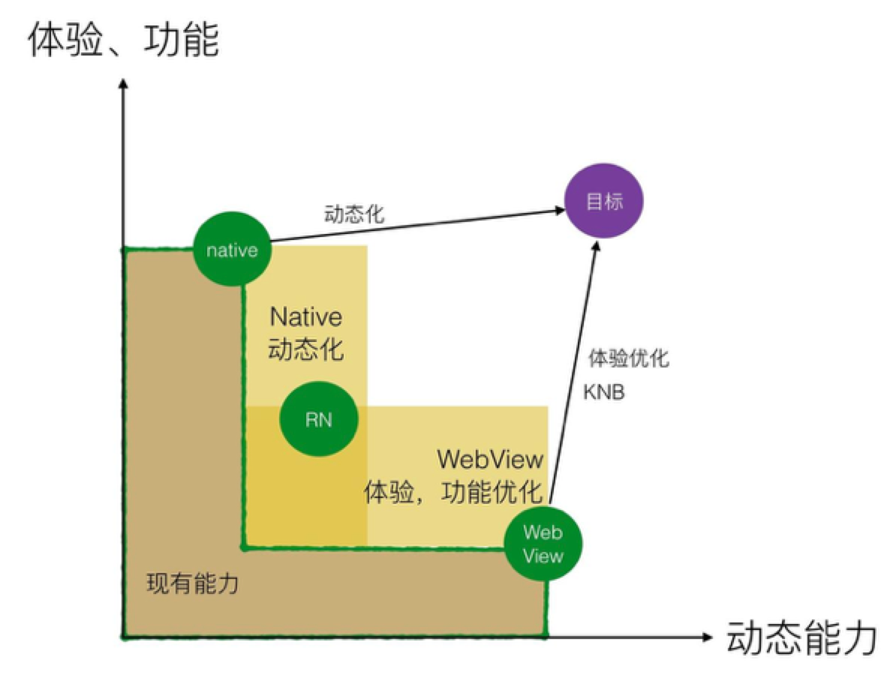
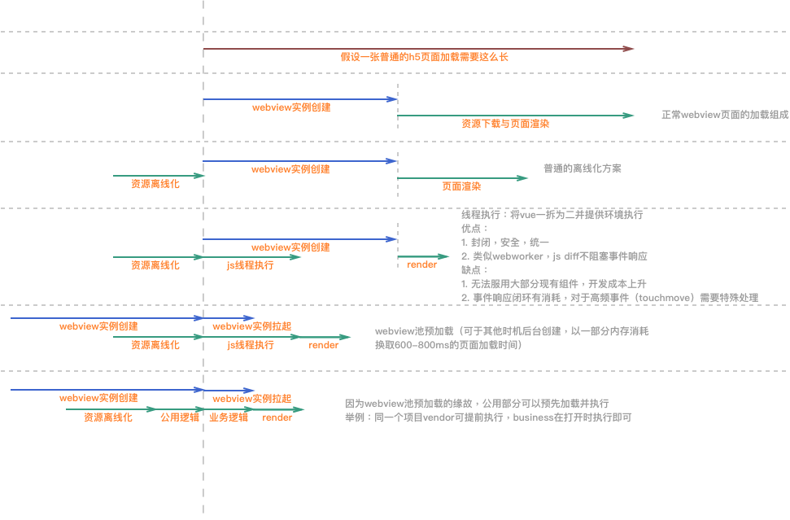
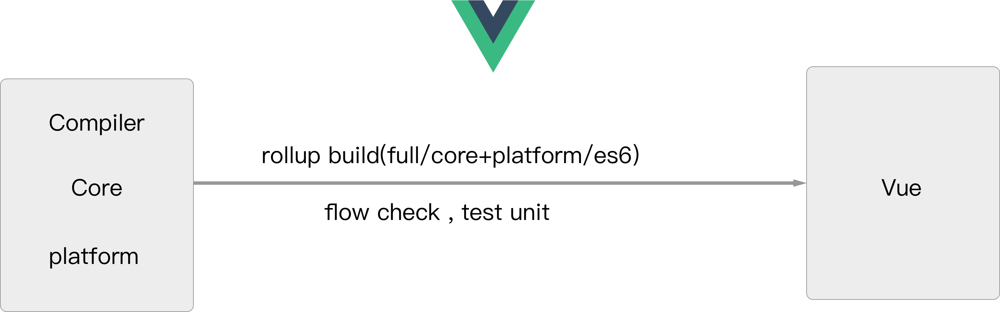
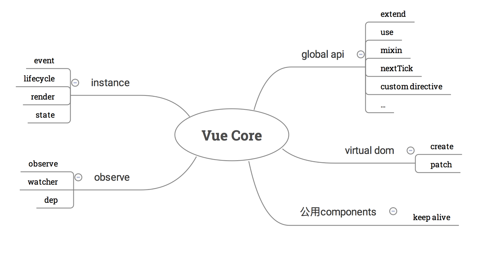
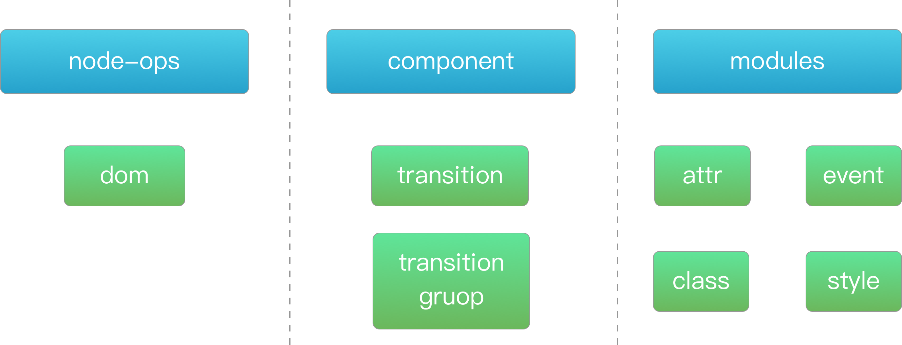
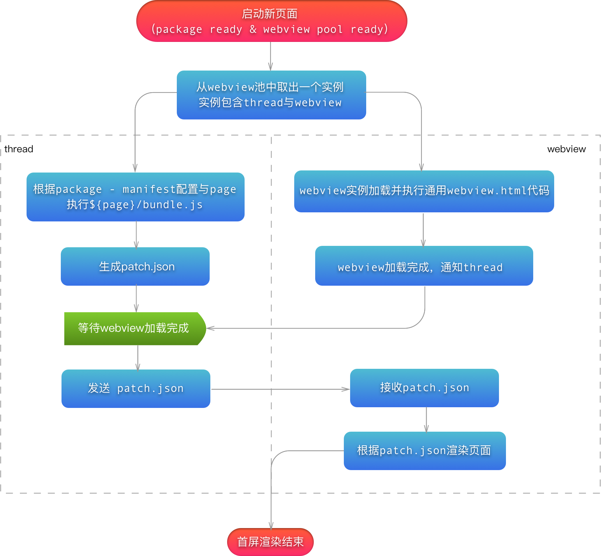
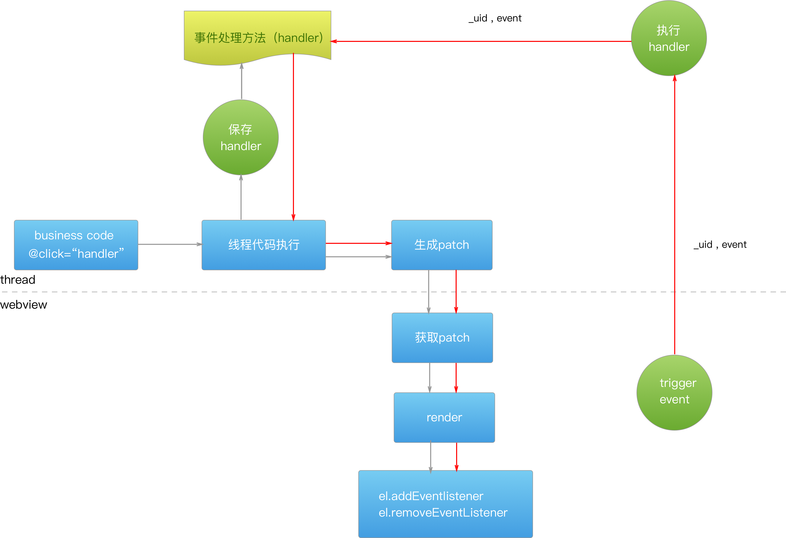
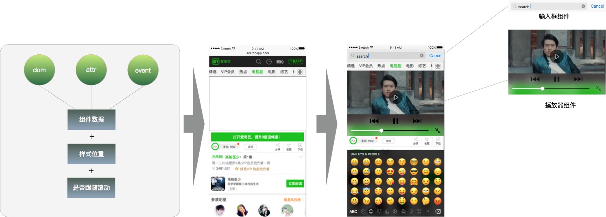

## liteApp前端框架



### webview提速的探索与实践
#### 提高页面首屏速度


### liteApp-fe
在准备开始开发liteApp时，考虑到其需要满足的特性，我们需要开发一个满足：
1. 轻量级 - 实际大小与内存耗损
2. 语法被主流所接受 - 降低门槛，提高开发效率
3. 虚拟dom - 在js中对dom进行模拟
4. 线程diff - 进一步提速
5. 组件系统 - 方便native组件的编写与调用

经过调研，vue中的大部分功能满足我们的需求，所以我们最后决定在vue的基础上进行二次开发。

### 前端框架核心

> 目录：lite-app/FE/mp-fe/mp-fe-core

liteApp-fe的核心实现基于vue进行开发，也使得liteApp可以完美继承vue的语法实现
#### vue
vue的架构简单清晰，主要分为三个部分：compiler,core与platform

##### Compiler（模版编译）

##### Core（核心代码）

##### Platform（Web）


#### lite-app改造：线程隔离
lite-app的运行环境有两部分：
* 线程
* webview

所以我们也将框架分为两部分
* thread：提供逻辑代码运行环境，保留virtual dom，进行diff运算并得出结果。最终传输给（告知）webview进行渲染
* webview：负责渲染diff结果，事件响应等

##### 首屏渲染流程：

##### <span id="event_pic">非首屏交互流程（事件系统）：</span>


##### 如何改造
对vue进行分析后，我们在不对compiler与core做变动的情况下，扩展了新的platform，以满足以上情况。这样做的好处：
* 语法：语法的支持主要通过Compiler部分，这样做可以保证兼容所有vue官方语法。
* 生态：原汁原味的vue，大部分的生态可以被支持（vuex，单文件组件等等）
* 易于改造：vue有着多platform架构（web，weex，server），使得变更渲染环境的二次开发更清晰，更不容易影响core的主要功能。
* 易于升级：vue的版本更新对我们的影响很小，我们要做的，只需要关注其暴露的渲染api（node-ops）即可

扩展功能：
* 指令收集与传递：代理并收集所有vue在diff后的操作指令（dom,attr,event等），在特定的时间点发出
* 指令传递时间点（patch）：经过多次改动，我们最终利用组件生命周期、nextTick以及排队机制实现，需要注意的是，第一次的patch需要等待webview发出finish_constructor指令（等待webview实例化）

```javascript
// public mount method
Vue.prototype.$mount = function (
  hydrating?: boolean
): Component {
  // regist mount patch for root
  bridge.readyToPatch();
  return mountComponent(this, undefined, hydrating)
}

// regist update patch
const _update = Vue.prototype._update;
Vue.prototype._update = function (vnode: VNode, hydrating?: boolean) {
  _update.call(this,vnode,hydrating);
  bridge.readyToPatch();
}

```

* 指令解析：webview部分的js代码，用于解析指令并渲染（ 类似json -> dom，实际比这个稍复杂一点 ）
* [事件系统，具体实现可以参考非首屏交互流程](#event_pic)
* 原生组件与api，后面说明

#### lite-app改造：原生api与组件
因为运行于线程的特殊性，没有document，window等浏览器api。
所以我们为lite-app提供了一套基础的api与组件，具体的列表可以查看
> - [Api文档](http://gitlab.qiyi.domain/cross-team/lite-app/blob/FE/FE/docs/Api.md)
> - [Component文档](http://gitlab.qiyi.domain/cross-team/lite-app/blob/FE/FE/docs/Component.md)
##### 如何实现
> 目录：liteapp/api/

api : 通过向JsCore注入的方式，使得js拥有直接调用native的能力，具体实现可以类比hybrid
* 使用native api，可以获得比web更高的控制权，更好的定制化，解锁更多web无法实现的功能

component : 在代码中使用预先提供的native组件，可以使用体验佳的原生组件。这也是lite-app中提升体验重要的一个功能。具体实现：
> 目录：liteapp/component/
* native view：在webview之上覆盖一层view用于渲染native组件。
* 样式位置：在webview渲染一个空的div作为占位，并将大小告知native。
* 是否跟随：同样通过参数告知native，以满足fixed情况
* 事件处理：native组件事件处理分两种；
1.将事件由native view穿透到占位div，由div进行处理（类似点击跳转等）。
2.将native事件直接截获并传递给线程（类似播放器开始，停止）



#### 至于三端
只需要实现了native api与component在web的polyfill，即可将lite-app合并（thread与webview代码同时运行于webview）并运行于web环境（lite-app的dev模式就是运行于web，基于webpack-dev-server实现）
